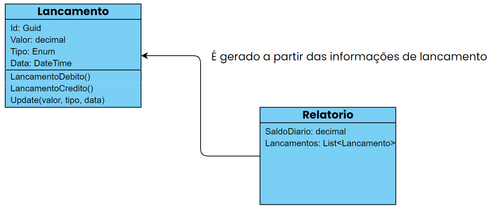

# ReportCash

Projeto realizado com objetivo de uma mini gestão lançamentos financeiros, retornando um relatório de seu total consolidado.

O objetivo deste projeto é, aperfeiçoar o framework, construindo uma **API REST**, utilizando recursos como:

- Swagger
- Arquitetura Limpa
    - Camadas -> Core, Infrastructure, Application, API
- Entity Framework Core (Em Memória)
- MediatR
- CQRS
- Padrão Repository
- Testes Unitários com xUnit
- Tratamento de Exceções

Mas quais funcionalidades foram implementadas?

- Cadastro, Atualização, Cancelamento e Consulta de um lançamento.
- Relatorio para verificar o saldo diário e a lista dos lançamentos que o compõe.
---

## Swagger

Ferramenta que simplifica o desenvolvimento de APIs, permitindo entre outras funcionalidades, a documentar e testar APIs. Ele consegue gerar uma interface gráfica contendo todos os pontos de acesso (Endpoints) da API, permitindo realizar requisições diretamente em sua interface.

---

## Arquitetura Limpa

Também conhecida como **Onion Architecture**, ou Arquitetura Cebola.
Tem como foco o **domínio** do sistema, tendo em sua essência o DDD - Domain Driven Design, sendo dividida em 4 camadas principais:

- Core, Infrastructure, Application e API
    - Core ou Domain:
        - Camada mais importante da Arquitetura Limpa. É nela onde o foco de desenvolvimento inicial deve estar. O Domain-Driven Design está bem caracterizado nos conceitos dessa arquitetura, por agregar a importância de se entender bem o domínio, as regras de negócio contidas nele, bem como o linguajar utilizado pelos diferentes usuários.(Ubíqua)
    - Infrastructure:
        - Camada responsável pelo código de infraestrutura, como acesso a dados, conexão com serviços de computação na nuvem, integração entre sistemas, entre outros.
        Cada um desses sub-itens pode ser dividido em projetos próprios, como Persistence, Integration e CloudService.
        - No acesso a dados podemos utilizar o Entity Framework Core correspondente ao contexto de dados normalmente utilizado com um arquivo DbContext.cs
        Onde é até possível mapear nossas entidades e as relacionar.
    - Application:
        - Camada responsável por código de aplicação, onde as funcionalidades expostas vão estar, em forma de serviços, normalmente são utilizados Commands ou Queries, mas vai depender do padrão utilizado.
        - Nessa camada também podemos criar nossos modelos de entrada e saída da aplicação, onde diretamente serão utilizados na nossa camada API.
    - API:
        - Application Programming Interface(Interface de Programação de Aplicação).
        - Camada responsável por toda interface do nosso código, seja ela uma API com padrão REST ou até mesmo uma View Controller do padrão MVC.
        - Aqui é onde tudo deve estar em pleno funcionamento pois ela depende de todas as outras camadas. Nessa camada nós configuramos a injeção de dependência e as demais implementações do projeto.

---

## Entity Framework Core (Em Memória)

EF Core In-Memory é a adição de um provedor de dados que torna possível prototipar aplicações e escrever testes sem ter que configurar um banco de dados local ou externo.

---

## Run e Build

- Build:
    - Uma boa prática após o clone de nosso projeto é realizar o build de nossa aplicação, pode ser realizado via terminal com o comando:
~~~ bash
dotnet build
~~~

- Run:
    - Para rodarmos nossa aplicação em modo **run** precisamos garantir que estamos com nossa linha de comando apontada para a camada de **API**, nela podemos utilizar o comando:
~~~ bash
dotnet run
~~~

- Run e Debug:
    - Em caso de necessitar de uma depuração do código e realizar uma análise mais profunda sobre o mesmo, podemos rodar em modo de depuração, onde utilizamos break points. Sendo assim a IDE irá realizar uma ''parada'' no momento em que a sua linha marcada está em execução:
~~~ bash
Basta apertar F5
~~~
---

## Desenho da Solução

---

## Build em Containers:
Passo 1: Crie um arquivo chamado "Dockerfile" na raiz do seu projeto. O Dockerfile é usado para definir as instruções de construção do contêiner.

Passo 2: Abra o arquivo Dockerfile em um editor de texto e adicione o seguinte conteúdo:
##### Use a imagem base adequada (por exemplo, uma imagem com suporte para sua linguagem de programação)
FROM <imagem_base>

##### Defina o diretório de trabalho no contêiner
WORKDIR /app

##### Copie os arquivos do projeto para o contêiner
COPY . .

##### Instale as dependências (se necessário)
RUN <comando_instalacao_dependencias>

##### Defina o comando padrão para ser executado quando o contêiner for iniciado
CMD <comando_execucao>

Certifique-se de substituir <imagem_base> pela imagem base adequada para o seu projeto (por exemplo, uma imagem Node.js para um projeto em JavaScript) e preencha <comando_instalacao_dependencias> com o comando necessário para instalar as dependências do projeto.

Em <comando_execucao>, insira o comando que será executado quando o contêiner for iniciado. Isso pode ser algo como iniciar um servidor web ou executar um arquivo principal do projeto.

Passo 3: Abra uma janela de terminal e navegue até o diretório do seu projeto.

Passo 4: Execute o seguinte comando para construir a imagem do Docker:
~~~text
docker build -t reportcash .
~~~

Isso irá construir a imagem Docker com base no seu Dockerfile. Certifique-se de incluir o ponto . no final do comando, pois isso indica o diretório atual como o contexto para a construção da imagem.

Passo 5: Depois que a imagem for construída com sucesso, você pode executar um contêiner com o seguinte comando:

~~~text
docker run -d --name reportcash-container reportcash
~~~
Isso criará um contêiner chamado "reportcash-container" usando a imagem "reportcash" que você construiu. O sinalizador -d indica que o contêiner será executado em segundo plano.

Tenha em mente que essas instruções são uma base para começar. Você precisará adaptá-las às necessidades específicas do seu projeto, como a escolha da imagem base correta e a configuração do comando de execução apropriado.

Certifique-se de ter o Docker instalado e em execução em sua máquina antes de seguir essas etapas.
